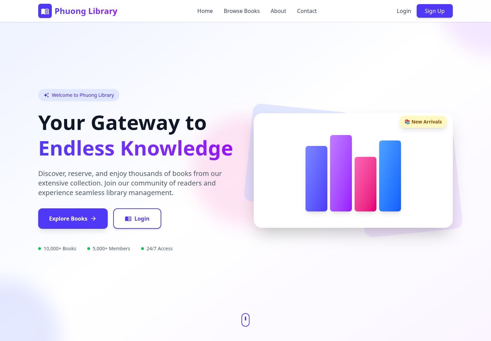
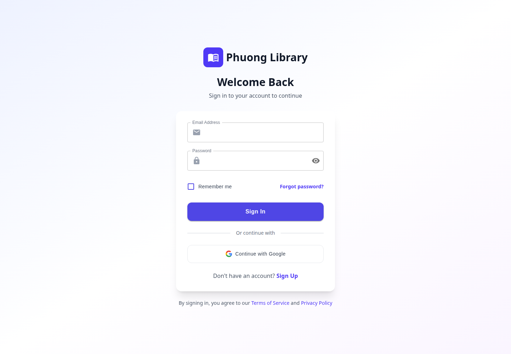
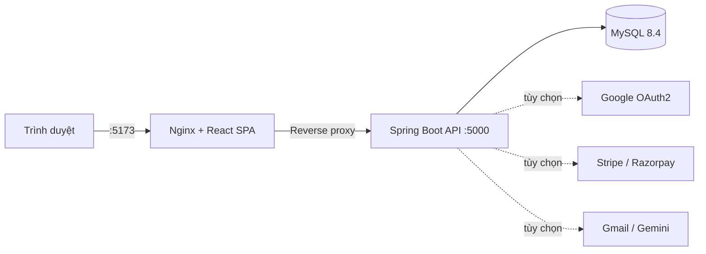

<div align="center">

# 📚 Phuong Library

### Nền tảng quản lý thư viện hiện đại cho độc giả và quản trị viên

[](https://openjdk.org/)
[](https://spring.io/projects/spring-boot)
[](https://react.dev/)
[](https://www.mysql.com/)
[](https://docs.docker.com/compose/)

</div>

Phuong Library là ứng dụng full-stack giúp số hóa quy trình thư viện: tìm kiếm sách, mượn–trả, đặt trước, đánh giá, wishlist, phí phạt, thanh toán, gói thành viên và thông báo. Hệ thống có trải nghiệm riêng cho độc giả cùng bảng điều khiển đầy đủ cho quản trị viên.

## ✨ Giao diện thực tế

Các ảnh dưới đây được chụp trực tiếp từ stack Docker đang chạy.

<table>
  <tr>
    <td width="50%"></td>
    <td width="50%"></td>
  </tr>
  <tr>
    <td align="center"><strong>Trang giới thiệu</strong></td>
    <td align="center"><strong>Đăng nhập và Google OAuth2</strong></td>
  </tr>
</table>

## 🚀 Tính năng nổi bật

| Dành cho độc giả | Dành cho quản trị viên |
| --- | --- |
| Đăng ký, đăng nhập JWT và Google OAuth2 | Dashboard tổng quan hoạt động thư viện |
| Duyệt, tìm kiếm và lọc sách theo thể loại | CRUD sách và thể loại phân cấp |
| Mượn, gia hạn, trả và xem lịch sử đọc | Quản lý mượn–trả, quá hạn và trạng thái |
| Đặt trước sách và theo dõi hàng chờ | Quản lý đặt trước và phê duyệt nghiệp vụ |
| Đánh giá, xếp hạng và wishlist | Kiểm duyệt đánh giá và quản lý người dùng |
| Theo dõi, thanh toán phí phạt | Tạo, miễn và thống kê phí phạt |
| Chọn gói thành viên và thanh toán | Quản lý gói, đăng ký và giao dịch |
| Nhận thông báo và tùy chỉnh cài đặt | Quản lý thông báo và tác vụ tự động |

## 🧩 Kiến trúc



- `frontend/`: React 19, Vite, Material UI, Tailwind CSS và Redux Toolkit.
- `backend/`: Spring Boot, Spring Security, JWT, OAuth2 Client, JPA/Hibernate và scheduler.
- `docker-compose.yml`: điều phối frontend, backend và MySQL trên mạng nội bộ riêng.
- `mysql_data`: Docker volume giữ dữ liệu qua các lần khởi động lại.

## 🐳 Khởi động nhanh bằng Docker

Yêu cầu duy nhất: Docker Engine có Docker Compose.

```bash
cp .env.example .env
docker compose up --build -d
docker compose ps
```

Sau khi ba container ở trạng thái `healthy`:

| Dịch vụ | Địa chỉ |
| --- | --- |
| Web app | http://localhost:5173 |
| Backend API | http://localhost:5000 |
| Backend health | http://localhost:5000/ |

Tài khoản quản trị mặc định cho môi trường phát triển:

```text
Email:    admin@library.local
Password: Admin@123
```

> [!IMPORTANT]
> Hãy đổi `JWT_SECRET`, `ADMIN_PASSWORD` và mật khẩu database trong `.env` trước khi triển khai. Admin chỉ được seed ở lần khởi tạo database đầu tiên.

Các lệnh vận hành thường dùng:

```bash
# Theo dõi log
docker compose logs -f backend frontend

# Dừng ứng dụng nhưng giữ dữ liệu
docker compose down

# Xóa cả dữ liệu MySQL và khởi tạo lại (không thể hoàn tác)
docker compose down -v
```

## ⚙️ Cấu hình môi trường

Sao chép `.env.example` thành `.env`. File `.env` đã được Git bỏ qua để tránh commit bí mật.

| Nhóm | Biến chính | Ghi chú |
| --- | --- | --- |
| Database | `DB_NAME`, `DB_USERNAME`, `DB_PASSWORD`, `DB_ROOT_PASSWORD` | MySQL nội bộ Docker |
| Bảo mật | `JWT_SECRET`, `ADMIN_EMAIL`, `ADMIN_PASSWORD` | Bắt buộc đổi khi deploy |
| URL | `FRONTEND_URL`, `BACKEND_URL`, `CORS_ALLOWED_ORIGINS` | Cập nhật theo domain thật |
| Google | `GOOGLE_CLIENT_ID`, `GOOGLE_CLIENT_SECRET` | Bật đăng nhập OAuth2 |
| Thanh toán | `STRIPE_API_KEY`, `RAZORPAY_KEY_ID`, `RAZORPAY_KEY_SECRET` | Tùy chọn |
| Email | `MAIL_USERNAME`, `MAIL_PASSWORD`, `MAIL_FROM` | Tùy chọn, mặc định tắt |
| AI | `GEMINI_API_KEY` | Tùy chọn |

## 💻 Chạy để phát triển

Backend yêu cầu JDK 17 và MySQL:

```bash
cd backend
export DB_HOST=localhost DB_PORT=3306 DB_NAME=library_management
export DB_USERNAME=root DB_PASSWORD=your_password
./mvnw spring-boot:run
```

Frontend yêu cầu Node.js 24+:

```bash
cd frontend
npm ci
npm run dev
```

Vite tự proxy API sang `http://localhost:5000`. Đặt `VITE_API_BASE_URL` trong `frontend/.env` nếu backend chạy ở địa chỉ khác.

## 🧪 Kiểm tra chất lượng

```bash
# Backend
cd backend && ./mvnw clean package -DskipTests

# Frontend
cd frontend && npm run lint && npm run build

# Docker
docker compose config
docker compose build
```

Stack đã được kiểm tra thực tế với MySQL 8.4: cả ba container đạt healthcheck, đăng nhập admin thành công và JWT truy cập được API hồ sơ qua Nginx reverse proxy.

## 🗂️ Cấu trúc repository

```text
.
├── frontend/                 # React/Vite SPA và Nginx config
│   ├── src/Admin/            # Dashboard quản trị
│   ├── src/components/       # Thành phần giao diện dùng chung
│   ├── src/pages/            # Các màn hình người dùng
│   ├── src/services/         # Tầng gọi API
│   └── src/store/            # Redux Toolkit
├── backend/                 # Spring Boot backend
│   └── src/main/java/com/phuong/
│       ├── controller/      # REST endpoints
│       ├── service/         # Business logic
│       ├── repository/      # Spring Data JPA
│       ├── modal/           # Entity model
│       ├── configurations/  # Security, JWT, OAuth2
│       ├── scheduler/       # Scheduled jobs
│       └── event/           # Payment events
├── docs/screenshots/        # Ảnh thật dùng trong README
├── docker-compose.yml       # Toàn bộ môi trường chạy
└── .env.example             # Mẫu cấu hình an toàn
```

## 🧭 Các mốc phiên bản lớn

| Commit | Nội dung |
| --- | --- |
| `800fe3a` | Chuyển đầy đủ backend sang namespace `com.phuong` |
| `2cb05d6` | Bổ sung React SPA và dashboard quản trị |
| `2186975` | Docker hóa MySQL, Spring Boot và React/Nginx |
| `b4aee92` | Đồng bộ thương hiệu, ảnh ứng dụng và tài liệu |
| `a1d6de2` | Chuẩn hóa tên module Spring Boot thành `backend/` |

---

<div align="center">

Made with ☕, Spring Boot and React — **Phuong Library**

</div>
